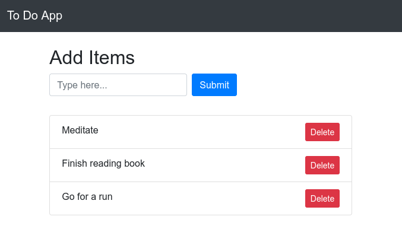

A simple To Do web app created using Django. 

You can access the app using the link:  
https://To-Do-App.rushil1904.repl.co

To create your own to do app simply fork this repository and run it on a local server or host it online. 